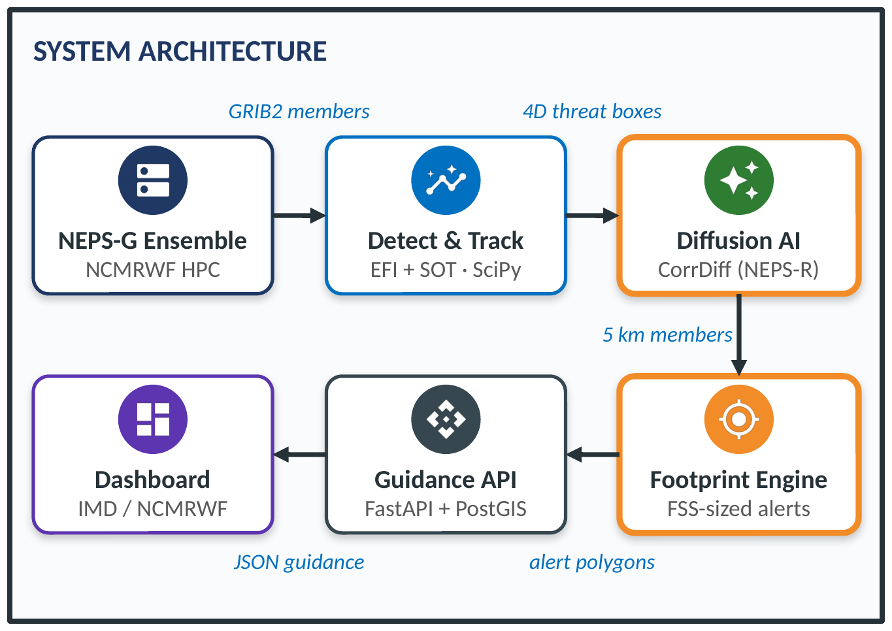
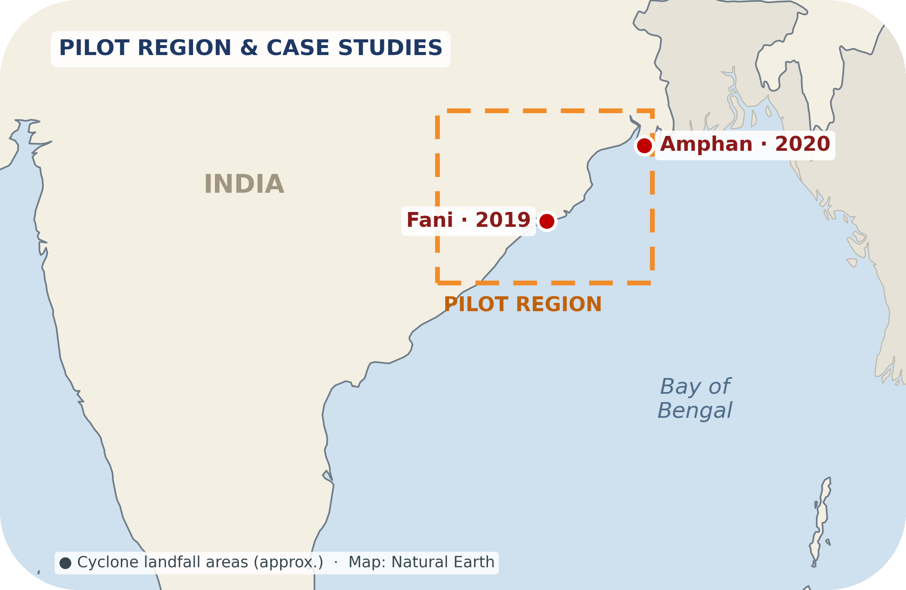
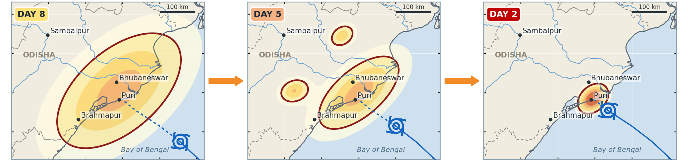

# MEGHA-DRISHTI — Documentation

| Document | What it contains |
|---|---|
| [**Detailed Technical Report (PDF)**](report/MEGHA-DRISHTI_Detailed_Report.pdf) | Full method: EFI/SOT formulas, tracking algorithm, CorrDiff downscaling, skill-aware footprints, data, architecture, API, verification plan, risks, references. Source: [`report/report.md`](report/report.md) |
| [**Research Notes (PS 26078)**](research/PS26078_RESEARCH_NOTES.md) | Existing systems and the day 4–10 gap, related work, design refinements with evidence, data availability, compute, risks, source library |
| [**Idea Presentation (PDF)**](presentation/CodeX_2026-26078.pdf) | SIH 2026 idea-submission deck |
| [Research Dossier](RESEARCH_DOSSIER.md) | Extended research write-up |
| [Architecture](ARCHITECTURE.md) · [Datasets](DATASETS.md) · [Validation](VALIDATION.md) · [Sources](SOURCES.md) | Supporting notes |

## Figures

| | |
|---|---|
|  |  |
| Lead-time gap: no high-resolution ensemble for days 4–10 | System architecture |
|  |  |
| Extreme Forecast Index (schematic) | Pilot region and case studies |

*Illustrative alert zones on real geography (Natural Earth). In the pilot, zones come from model output.*
