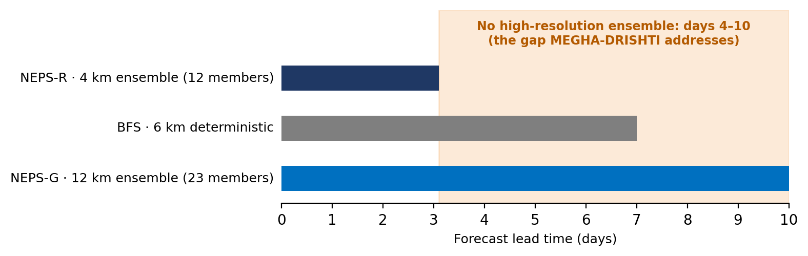
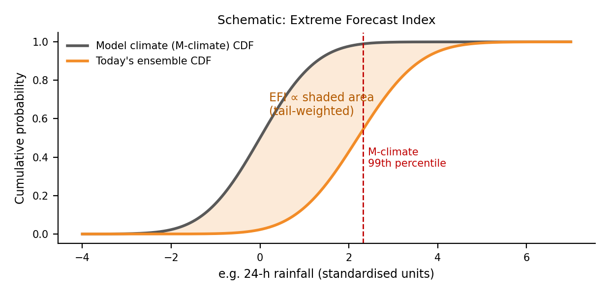

Smart India Hackathon 2026 · Problem Statement 26078

<h1 class="cover-title">MEGHA-DRISHTI मेघ-दृष्टि</h1>

AI-Driven Tracking and Peak-Preserving Downscaling of Extreme Weather in Medium-Range Ensemble Forecasts

<b>Detailed Technical Report</b> 
Sponsoring organisation: National Centre for Medium Range Weather Forecasting (NCMRWF), Ministry of Earth Sciences 
Theme: Smart Automation · Category: Software 
Team: CodeX_2026 · Team ID: 159951 
Version 1.0 · September 2026

This report describes a proposed system and pilot plan at the idea-submission stage. Figures marked <i>Schematic</i> or <i>Illustrative</i> explain concepts and are not model results. All quantitative facts are taken from the cited sources.

# Contents

1. Executive summary
2. Problem definition
3. Current systems and the gap
4. Related work
5. Proposed system overview
6. Stage 1 — Detection and tracking
7. Stage 2 — Per-member, peak-preserving downscaling
8. Stage 3 — Probabilities and skill-aware footprints
9. Data
10. System architecture and guidance API
11. Verification plan
12. Pilot plan
13. Feasibility, risks and mitigation
14. Impact and deployment pathway
15. Limitations
16. References

# 1. Executive summary

NCMRWF's global ensemble prediction system, NEPS-G, provides 23 ensemble members out to 10 days at 12 km resolution. For the first three days, NCMRWF also runs a 4 km regional ensemble, NEPS-R, with explicitly resolved convection. Beyond day 3, forecasters have only 12 km ensemble guidance, and extreme events must largely be identified by manual inspection of charts.

MEGHA-DRISHTI is a post-processing pipeline that runs after each NEPS-G cycle and does three things:

1. **Detects and tracks extreme anomalies.** It computes the Extreme Forecast Index (EFI) and Shift of Tails (SOT) for each grid point against a NEPS-G model climate, groups abnormal regions into anomaly objects, and links them across lead times into four-dimensional threat tracks.
2. **Downscales every ensemble member.** Inside each threat region it applies a conditional diffusion model (the published CorrDiff approach) to each of the 23 members, producing ~5 km fields that retain extreme amplitudes. The model is trained on pairs of NEPS-G (12 km) and NEPS-R (4 km) fields from NCMRWF's own systems.
3. **Issues skill-aware guidance footprints.** Exceedance probabilities are computed from the downscaled members, and the spatial size of each guidance footprint is set by the skill the system has demonstrated at that lead time, measured with the Fractions Skill Score.

The design differs from a direct reading of the problem statement in four evidence-based ways, summarised in Table 1.

<table class="t">
<tr><th>Design choice</th><th>Reason</th><th>Source</th></tr>
<tr><td>EFI computed against a NEPS-G <b>model climate</b>, not ERA5</td><td>EFI is defined relative to the model's own climate for the same location, time of year and lead time; this separates genuine anomalies from model bias</td><td>ECMWF Forecast User Guide §8.1.9</td></tr>
<tr><td><b>Deterministic</b> detection and tracking</td><td>EFI and SOT are closed-form statistics of the ensemble distribution; a learned model is not required to compute them, and a deterministic method is fully explainable</td><td>ECMWF FUG §8.1.9</td></tr>
<tr><td>Downscale <b>each member</b>, never the ensemble mean</td><td>Averaging uncertain ensemble members produces a blurrier field, removing the peaks forecasters need</td><td>Price et al., 2025 (GenCast)</td></tr>
<tr><td>Footprint size set by <b>measured skill</b>, not a fixed 5 km</td><td>Intrinsic predictability for scales below ~100 km is under a day; precise 5 km pinpoints at day 7–10 would overstate precision</td><td>Weng et al., 2026; Taraphdar et al., 2014</td></tr>
</table>

Table 1. Key design choices and their basis.

The pilot targets one region (the Odisha coast), three variables (24 h rainfall, 10 m wind, 2 m temperature) and historical case replays, with a statistical baseline run alongside the AI model so that every claimed improvement is measured.

# 2. Problem definition

## 2.1 The operational problem

Extreme events — severe cyclones, heat domes, cold waves, extreme rainfall — must be anticipated days in advance for preparedness to be effective. Medium-range ensembles provide this lead time, but in two forms that limit their usefulness at local scale:

- **Coarse resolution.** At 12 km, localised extremes such as orographic rainfall maxima or a cyclone's core winds are partially resolved. NCMRWF's own verification of the 12 km NEPS notes that this resolution may still be too coarse to capture very localised extreme events (Atmospheric Research, 2019).
- **Manual interpretation.** Identifying where the ensemble signals an abnormal event, and following it across lead times, is done largely by inspecting charts.

## 2.2 Why standard deep learning is insufficient

Deep networks trained with mean-squared-error losses regress towards the conditional mean and produce smoothed fields that lose small-scale structure and peak intensities. This has been documented for machine-learned global forecast models, which blur at long lead times (Price et al., 2025). A second, independent source of smoothing is the ensemble mean itself: when members disagree on the location of a feature, their average spreads it out and lowers its peak.

## 2.3 Precise problem statement

> For forecast days 4–10, where no high-resolution ensemble exists, provide forecasters with (a) automated identification and tracking of extreme anomalies in NEPS-G, and (b) high-resolution probabilistic guidance that preserves extreme amplitudes, with spatial precision that never exceeds what the system has demonstrated skill to deliver.

# 3. Current systems and the gap

## 3.1 Relevant MoES/NCMRWF systems

<table class="t">
<tr><th>System</th><th>Description</th><th>Relevance</th></tr>
<tr><td>NEPS-G</td><td>Global ensemble, 12 km, 23 members (1 control + 22 perturbed), 10-day forecasts; based on the UK Met Office MOGREPS system; operational at 12 km since June 2018</td><td>Primary input</td></tr>
<tr><td>NEPS-R</td><td>Regional ensemble, 4 km, 12 members, forecasts to ~72–75 h, convection explicitly resolved</td><td>Training target</td></tr>
<tr><td>NCUM-G / NCUM-R</td><td>Deterministic global (12 km, 10 days) and regional (4 km, 72 h; 1.5 km, 48 h) models on the Mihir HPC</td><td>Deterministic reference</td></tr>
<tr><td>Bharat Forecast System (IITM)</td><td>6 km deterministic global model over 30°S–30°N, launched May 2025 on the Arka HPC</td><td>Complementary</td></tr>
<tr><td>IMDAA reanalysis</td><td>12 km, hourly regional reanalysis, 1979–2020, available on registration via NCMRWF's data portal</td><td>Climatology and fallback training data</td></tr>
</table>

Table 2. Existing systems (sources: NCMRWF/WMO training 2022; Rani et al. 2021; MoES 2025–26).

## 3.2 The gap

Figure 1. Coverage of India's operational high-resolution and ensemble guidance by lead time. For days 4–10 no high-resolution ensemble is available.

High-resolution deterministic guidance (BFS, 6 km) extends to day 7, but a single deterministic run cannot express uncertainty. High-resolution ensemble guidance (NEPS-R) stops at about day 3. The gap MEGHA-DRISHTI addresses is therefore specific: **high-resolution probabilistic guidance for days 4–10**.

The Ministry has stated, in a February 2026 reply in the Rajya Sabha, that IITM and NCMRWF are working on AI in forecasting alongside ensemble systems and impact-based forecasting under Mission Mausam. MEGHA-DRISHTI is designed to fit that direction.

# 4. Related work

**Extreme Forecast Index and Shift of Tails (ECMWF).** EFI measures the difference between the cumulative distribution function (CDF) of the current ensemble forecast and the model-climate CDF for the same location, season and lead time, with extra weight on the tails. Because members far beyond the climate extreme contribute no more to EFI than members just at it, SOT was introduced to indicate how extreme an event could be (ECMWF Forecast User Guide §8.1.9).

**GraphCast and GenCast (Google DeepMind).** GraphCast is a graph neural network on an icosahedral multimesh trained on ERA5; as a deterministic, MSE-trained model it blurs at long lead times. GenCast, a diffusion model on a spherical mesh, produces sharp ensemble members with realistic power spectra and outperforms ECMWF's ENS on most evaluated targets, while its ensemble mean remains blurred by construction (Price et al., 2025). Both operate at 0.25°.

**CorrDiff (NVIDIA).** CorrDiff downscales coarse atmospheric fields using a two-step approach: a UNet regression predicts the conditional mean, and a diffusion model generates the residual, producing fine-scale detail stochastically. It was demonstrated from 25 km to 2 km over Taiwan and reproduces realistic power spectra and distributions; its authors note that typhoon structure is only partly corrected, with the radius of maximum winds reduced from 75 km to about 50 km versus 25 km in the high-resolution reference (Mardani et al., 2025). An ensemble version downscaling US GEFS forecasts to 3 km HRRR fields exists in NVIDIA's model catalogue, and the code is open-source in NVIDIA PhysicsNeMo.

**Physical constraints in ML forecasts.** ECMWF's AIFS added bounding layers to eliminate physically impossible outputs such as negative precipitation (ECMWF, 2025).

**Indian ML resources.** IndiaWeatherBench provides a curated, ML-ready benchmark derived from IMDAA (2025). IPED provides a station-based 0.1° daily ensemble rainfall dataset for India, 1991–2020 (Scientific Data, 2025).

**Position of this work.** The components exist separately. What has not been assembled is a pipeline that applies EFI/SOT to NEPS-G, downscales NEPS-G members using NEPS-R as the high-resolution target, and ties guidance precision to verified skill.

# 5. Proposed system overview

MEGHA-DRISHTI runs automatically after each NEPS-G cycle (00 and 12 UTC) in three stages.

<table class="t">
<tr><th>Stage</th><th>Input</th><th>Method</th><th>Output</th></tr>
<tr><td>1. Detect &amp; track</td><td>23 NEPS-G members, all lead times</td><td>EFI + SOT vs NEPS-G model climate; connected-component labelling; linking across lead times</td><td>Anomaly objects and 4D tracks with bounding boxes</td></tr>
<tr><td>2. Downscale</td><td>Each member inside each bounding box, plus terrain</td><td>CorrDiff (UNet regression + diffusion residual), physics checks, statistical baseline in parallel</td><td>~5 km fields for every member</td></tr>
<tr><td>3. Probability &amp; footprint</td><td>Downscaled members; skill tables</td><td>Exceedance probabilities; footprint scale from Fractions Skill Score</td><td>Guidance polygons with category and confidence</td></tr>
</table>

Table 3. Pipeline stages.

# 6. Stage 1 — Detection and tracking

## 6.1 Model climate

For each variable, grid point, lead-time window and season, the model climate is the distribution of NEPS-G forecasts from past years. Operational NEPS-G at 12 km has run since June 2018, giving several years of archived forecasts. Because this sample is small compared with a dedicated reforecast climate, the sample is enlarged by pooling (i) a ±15-day seasonal window around the target date, (ii) neighbouring grid points within a small radius, and (iii) all ensemble members. Tail noise in this climate is a known limitation and is quantified during verification.

## 6.2 Extreme Forecast Index and Shift of Tails

Figure 2. Schematic: EFI is proportional to the tail-weighted area between the model-climate CDF and today's ensemble CDF.

Following the ECMWF definition, with F(p) the proportion of ensemble members lying below the p-th quantile of the model climate:

EFI = (2 / π) ∫01 [ p − F(p) ] / √( p (1 − p) ) dp,&nbsp;&nbsp;&nbsp; EFI ∈ [−1, 1]

For the upper tail, with G the model-climate distribution and F the forecast distribution:

SOT = − [ G−1(0.99) − F−1(0.90) ] / [ G−1(0.99) − G−1(0.90) ]

A positive SOT means at least 10% of members exceed the model climate's 99th percentile. A lower-tail version for 2 m temperature supports cold-wave detection.

## 6.3 Anomaly objects and tracking

1. **Masking.** A grid point is flagged when EFI exceeds a threshold (initially 0.5, tuned in verification) and SOT is positive, for the variable and accumulation window concerned.
2. **Objects.** Flagged points are grouped with 8-connected component labelling; objects below a minimum area are discarded.
3. **Linking.** Objects at successive lead times are linked by spatial overlap and centroid distance, resolved with an assignment step, producing a track.
4. **Cyclones.** For tropical cyclones, member-level positions are additionally derived from mean-sea-level-pressure minima, giving a spread of tracks.
5. **Output.** Each track stores its bounding box per lead time, peak EFI and SOT, and member agreement (the fraction of members exceeding the relevant threshold).

The stage is deterministic, fast and fully explainable: every flagged object can be traced to the ensemble values that produced it.

# 7. Stage 2 — Per-member, peak-preserving downscaling

## 7.1 Model

Downscaling uses the CorrDiff formulation as implemented in NVIDIA PhysicsNeMo:

- **Regression step:** a UNet predicts the conditional mean of the high-resolution field.
- **Diffusion step:** a denoising diffusion model generates the residual between the high-resolution field and that mean, restoring fine-scale structure stochastically.

Because the diffusion model samples from a distribution rather than predicting its mean, it can reproduce realistic intensity tails and power spectra, which is the property this problem requires.

## 7.2 Inputs and targets

<table class="t">
<tr><th></th><th>Details</th></tr>
<tr><td>Conditioning inputs (12 km)</td><td>24 h rainfall, 10 m u/v wind, 2 m temperature, mean-sea-level pressure, total column water vapour, 850 hPa wind and humidity</td></tr>
<tr><td>Static inputs</td><td>Terrain height, land–sea mask, latitude/longitude</td></tr>
<tr><td>Lead-time input</td><td>Forecast lead time as an embedding, to condition on growing uncertainty</td></tr>
<tr><td>Targets (~5 km)</td><td>NEPS-R 24 h rainfall, 10 m wind, 2 m temperature, regridded to a 5 km grid</td></tr>
<tr><td>Pilot domain</td><td>Odisha and the adjoining Bay of Bengal coast</td></tr>
</table>

Table 4. Model inputs and targets.

## 7.3 Why every member is downscaled

Downscaling is applied independently to each of the 23 members inside each threat region. Probabilities are computed only after downscaling. Downscaling the ensemble mean would inherit its blurring and defeat the purpose.

## 7.4 Physical consistency

Three constraints are applied, chosen because each can be enforced and checked:

1. **Non-negativity** of precipitation, through a bounding output layer, as adopted in ECMWF's AIFS.
2. **Coarsen-consistency:** aggregating the ~5 km output back to 12 km must reproduce the input field within a tolerance. This prevents the model from inventing events absent from the parent member. Members that fail are flagged and replaced by the statistical baseline for that case.
3. **Bounded humidity and wind** within physical ranges.

A moisture-flux-convergence consistency term, computed with MetPy, will be evaluated as an experiment rather than assumed.

## 7.5 Statistical baseline

A baseline runs alongside the diffusion model on every case: bilinear interpolation followed by quantile mapping to the NEPS-R climatology, with a terrain-regression correction. All reported gains of the diffusion model are relative to this baseline.

## 7.6 The lead-time shift

NEPS-R exists only to ~75 h, so training pairs come from days 0–3, while the model is applied at days 4–10. This is the principal scientific risk. Mitigations are lead-time conditioning, coarsen-consistency checks at every lead, and comparison of the statistics of downscaled day 4–10 members with NEPS-R climatology. Results will be reported separately by lead time.

# 8. Stage 3 — Probabilities and skill-aware footprints

## 8.1 Exceedance probabilities

For thresholds such as 24 h rainfall above 64.5, 115.6 and 204.5 mm or 10 m wind above a set speed, the probability at each ~5 km point is the fraction of downscaled members exceeding it. Thresholds will be aligned with IMD's operational categories.

## 8.2 Footprint sizing with the Fractions Skill Score

The Fractions Skill Score (FSS; Roberts &amp; Lean, 2008) compares forecast and observed exceedance fractions within neighbourhoods of size n:

FSS(n) = 1 − Σ ( Pf − Po )2 / [ Σ Pf2 + Σ Po2 ]

FSS rises with neighbourhood size; the smallest scale at which it exceeds the "useful" level (0.5 + f0/2, where f0 is the observed event frequency) is the finest scale the forecast can be trusted at. From verification over past seasons, a skill table records this scale for each variable, threshold and lead time. The footprint for a new forecast is drawn at that scale: broad at long lead times, progressively tighter as skill increases.

Figure 3. Illustrative: guidance footprints on real geography (Natural Earth) for an approaching cyclone. The footprint is regional at day 8, highlights terrain-exposed areas at day 5, and becomes tight near landfall by day 2. Zones are hand-drawn to explain the concept; in the pilot they are generated by the model.

Within a broad footprint, downscaled members still add value: they indicate which terrain-exposed parts of the region are most at risk, without claiming a precise location.

# 9. Data

<table class="t">
<tr><th>Dataset</th><th>Resolution / coverage</th><th>Use</th><th>Access</th></tr>
<tr><td>NEPS-G archive</td><td>12 km, 23 members, 10 days</td><td>Input; model climate</td><td>Requested from NCMRWF</td></tr>
<tr><td>NEPS-R archive</td><td>4 km, 12 members, ~75 h</td><td>Training target</td><td>Requested from NCMRWF</td></tr>
<tr><td>IMDAA</td><td>12 km, hourly, 1979–2020</td><td>Climatology; fallback training</td><td>Registration, NCMRWF data portal</td></tr>
<tr><td>IndiaWeatherBench</td><td>Curated from IMDAA</td><td>Faster data preparation</td><td>Open</td></tr>
<tr><td>IPED</td><td>0.1° daily rainfall, 30-member, 1991–2020</td><td>Observational verification</td><td>Open</td></tr>
<tr><td>GPM IMERG</td><td>0.1° satellite precipitation</td><td>Verification</td><td>NASA Earthdata</td></tr>
<tr><td>ECMWF AIFS ENS open data</td><td>0.25°, 15 days</td><td>Robustness tests; prototype</td><td>Open, CC-BY 4.0</td></tr>
<tr><td>Terrain (SRTM/GMTED)</td><td>30–90 m</td><td>Static conditioning</td><td>Open</td></tr>
</table>

Table 5. Data sources.

**Fallback plan.** If NEPS-G/NEPS-R archives cannot be provided within the hackathon timeline, a proof of concept will be trained on IMDAA, pairing coarsened and native-resolution fields. This will be disclosed explicitly, and the NEPS-based model will follow once data is available.

**Ground truth.** No observational 5 km dataset exists for India at scale; the finest station-based product is 0.1°. The downscaling target is therefore model output (NEPS-R), and verification against observations uses IPED and IMERG at their native resolution.

# 10. System architecture and guidance API

Figure 4. System architecture. Every component names its tool; arrows carry the data labelled.

<table class="t">
<tr><th>Layer</th><th>Technology</th><th>Role</th></tr>
<tr><td>Data</td><td>cfgrib, xarray, Dask, Zarr</td><td>Chunked, parallel handling of 4D ensemble data</td></tr>
<tr><td>Meteorology</td><td>MetPy</td><td>Derived variables and physical checks</td></tr>
<tr><td>Detection &amp; tracking</td><td>NumPy, SciPy (ndimage)</td><td>EFI/SOT, labelling, linking</td></tr>
<tr><td>Downscaling</td><td>PyTorch, NVIDIA PhysicsNeMo (CorrDiff)</td><td>Training and inference</td></tr>
<tr><td>Storage &amp; API</td><td>PostgreSQL + PostGIS, FastAPI</td><td>Anomaly objects, polygons, guidance endpoints</td></tr>
<tr><td>Dashboard</td><td>Next.js, MapLibre</td><td>Forecaster views</td></tr>
<tr><td>Operations</td><td>Docker / Apptainer on HPC, OpenTelemetry</td><td>Deployment and monitoring</td></tr>
</table>

Table 6. Technology stack.

**Guidance API (authenticated, for forecasters).** Illustrative endpoints:

<pre>
GET /cycles/{cycle_id}/threats            list anomaly tracks for a NEPS-G cycle
GET /threats/{threat_id}                  track, bounding boxes, EFI/SOT, member agreement
GET /threats/{threat_id}/footprints?lead=120
GET /threats/{threat_id}/probability?var=rain24&amp;threshold=115.6&amp;lead=120
</pre>

<pre>
{
  "threat_id": "2026091200-TC-01",
  "variable": "rain24",
  "lead_hours": 120,
  "category": "moderate",
  "probability_max": 0.41,
  "footprint_scale_km": "from skill table",
  "member_agreement": "fraction of members above threshold",
  "model_version": "megha-drishti-0.1 / NEPS-G version",
  "label": "Guidance for IMD forecasters - not a public warning"
}
</pre>

Public weather warnings in India are issued by IMD. The API therefore serves forecasters and impact-based forecasting teams, and every payload carries a guidance label.

# 11. Verification plan

<table class="t">
<tr><th>Question</th><th>Metric</th></tr>
<tr><td>Are extremes preserved?</td><td>Radially averaged power spectrum vs NEPS-R; quantile–quantile comparison of the 90th–99.9th percentiles</td></tr>
<tr><td>Are probabilities accurate?</td><td>Continuous Ranked Probability Score (CRPS); Brier score at IMD thresholds</td></tr>
<tr><td>Are probabilities reliable?</td><td>Reliability diagrams; spread–skill ratio</td></tr>
<tr><td>At what scale is guidance skilful?</td><td>Fractions Skill Score by neighbourhood size and lead time</td></tr>
<tr><td>Is output physically consistent?</td><td>Coarsen-consistency error; frequency of negative or out-of-range values</td></tr>
<tr><td>Does tracking find real events?</td><td>Hit rate and false-alarm ratio of anomaly objects against recorded extreme events</td></tr>
<tr><td>Cyclone structure</td><td>Radius-of-maximum-wind and peak-wind error for case studies</td></tr>
</table>

Table 7. Verification metrics. All are reported against the statistical baseline and separately by lead time.

**Evaluation protocol.** A full season is held out for testing; no random splitting of time series. Case studies are chosen from documented Odisha-coast events, including Cyclone Fani (landfall near Puri, May 2019) and Cyclone Amphan (May 2020), subject to archive availability.

# 12. Pilot plan

<table class="t">
<tr><th>Phase</th><th>Duration</th><th>Output</th></tr>
<tr><td>Data &amp; setup</td><td>Week 1</td><td>Formal data request; IMDAA/IndiaWeatherBench download; Zarr pipeline</td></tr>
<tr><td>Stage 1</td><td>Weeks 2–4</td><td>Model climate, EFI/SOT, detection and tracking</td></tr>
<tr><td>Baseline</td><td>Weeks 3–4</td><td>Quantile mapping + terrain regression</td></tr>
<tr><td>Stage 2</td><td>Weeks 4–7</td><td>CorrDiff training on the pilot region; physics checks</td></tr>
<tr><td>Stage 3 &amp; verification</td><td>Weeks 6–8</td><td>Probabilities, FSS skill tables, footprints, metric reports</td></tr>
<tr><td>Dashboard, API, demo</td><td>Weeks 5–9</td><td>Forecaster views, endpoints, case-study replay</td></tr>
</table>

Table 8. Pilot schedule.

**Scope.** One region, three variables, historical replays. Pilot-scale CorrDiff training is expected to be of the order of NVIDIA's CorrDiff-Mini example (about 10 A100 GPU-hours); full-domain training is of the order of the continental-US CorrDiff model (about 5,000 A100 GPU-hours), which belongs on MoES HPC (NVIDIA PhysicsNeMo documentation).

# 13. Feasibility, risks and mitigation

<table class="t">
<tr><th>Risk</th><th>Level</th><th>Mitigation</th></tr>
<tr><td>NEPS-G/NEPS-R archives are not public</td><td class="hi">High</td><td>Formal request in week 1; IMDAA fallback, clearly disclosed</td></tr>
<tr><td>Training on days 0–3, applying at days 4–10</td><td class="hi">High</td><td>Lead-time conditioning; coarsen-consistency at every lead; per-lead reporting</td></tr>
<tr><td>Diffusion may not beat statistics for some variables</td><td class="md">Medium</td><td>Baseline always runs; results reported honestly per variable</td></tr>
<tr><td>Cyclone intensity under-corrected</td><td class="md">Medium</td><td>Known CorrDiff limitation; report structure errors explicitly</td></tr>
<tr><td>Noisy tails in a short model climate</td><td class="md">Medium</td><td>Seasonal and spatial pooling; quantify tail uncertainty</td></tr>
<tr><td>False precision at long lead times</td><td class="md">Medium</td><td>Footprints sized from FSS skill tables</td></tr>
<tr><td>NEPS-G upgrades change input statistics</td><td class="lo">Low</td><td>Model pinned to NEPS-G version; input-drift monitoring triggers retraining</td></tr>
</table>

Table 9. Risk register.

**Technical feasibility.** Every component is published and open-source; the pipeline composes them rather than inventing new theory. **Operational feasibility.** The system runs after each NEPS-G cycle as a post-processing job and fits existing workflows. **Economic feasibility.** Inference on GPUs is inexpensive compared with running an additional high-resolution ensemble to day 10.

# 14. Impact and deployment pathway

<table class="t">
<tr><th>User</th><th>Today</th><th>With MEGHA-DRISHTI</th></tr>
<tr><td>IMD duty forecasters</td><td>Scan ensemble charts manually</td><td>Ranked threats with evidence each cycle</td></tr>
<tr><td>Disaster managers (via IMD)</td><td>District-wide warnings</td><td>Terrain-aware guidance zones</td></tr>
<tr><td>Farmers (via agromet advisories)</td><td>Coarse guidance at days 4–10</td><td>Local frost, hail and heat risk</td></tr>
<tr><td>NCMRWF scientists</td><td>No high-resolution ensemble after day 3</td><td>AI guidance to day 10 with automatic verification</td></tr>
</table>

Table 10. Expected impact by user. These outcomes are to be validated in the pilot.

**Deployment pathway.**

1. **Phase 1 (SIH):** one region, three variables, case-study replay.
2. **Phase 2 (pilot at NCMRWF):** multiple regions; ECMWF AIFS ENS as a second input stream for robustness.
3. **Phase 3 (operational):** all-India on MoES HPC, feeding IMD impact-based forecasting, with seasonal verification scorecards.

The system is intended as an open-source, MoES-owned tool operated by NCMRWF and used by IMD, complementary to the Bharat Forecast System.

# 15. Limitations

- The downscaling target is model output, not observations; the system emulates NCMRWF's 4 km ensemble rather than reality directly.
- Skill at days 4–10 is unknown until measured; the lead-time shift may reduce it.
- The NEPS-G model climate is shorter than a dedicated reforecast climate, so extreme tails are uncertain.
- The pilot covers one region and a few variables; generalisation to other regions and hazards must be demonstrated separately.
- The system depends on NEPS-G being run; it does not replace numerical weather prediction.

# 16. References

1. NCMRWF. *Ensemble Prediction System for Tropical Cyclone prediction.* WMO Tropical Cyclone Forecasting training, New Delhi, 2022. <a href="https://severeweather.wmo.int/TCFW/NewDelhi_Training2022/2_EPS_for_TC_Prediction_AS.pdf">Link</a>
2. Verification of high resolution (12 km) Global Ensemble Prediction System. *Atmospheric Research*, 2019. <a href="https://www.sciencedirect.com/science/article/abs/pii/S0169809519305484">Link</a>
3. Rani, S. I. et al. IMDAA: High-resolution satellite-era reanalysis for the Indian monsoon region. *Journal of Climate*, 34(12), 2021. <a href="https://journals.ametsoc.org/view/journals/clim/34/12/JCLI-D-20-0412.1.xml">Link</a>
4. NCMRWF Reanalysis Data Service (IMDAA, NGFS). <a href="https://www.ncmrwf.gov.in/data/">Link</a>
5. Ministry of Earth Sciences. Reply on improving weather forecasting capabilities, Rajya Sabha, 12 February 2026. <a href="https://www.moes.gov.in/static/uploads/2026/02/c93fe1dfa6791c76462e5106561eaa1e.pdf">Link</a>
6. ECMWF. *Forecast User Guide*, Section 8.1.9: Extreme Forecast Index and Shift of Tails. <a href="https://confluence.ecmwf.int/display/FUG/Section+8.1.9+Extreme+Forecast+Index+-+EFI,+and+Shift+of+Tails+-+SOT">Link</a>
7. ECMWF. An update to ECMWF's machine-learned weather forecast model AIFS. arXiv:2509.18994, 2025. <a href="https://arxiv.org/html/2509.18994v1">Link</a>
8. Price, I. et al. GenCast: Diffusion-based ensemble forecasting for medium-range weather. *Nature*, 2025 (arXiv:2312.15796). <a href="https://arxiv.org/pdf/2312.15796">Link</a>
9. Mardani, M. et al. Residual corrective diffusion modeling for km-scale atmospheric downscaling. *Communications Earth &amp; Environment*, 2025. <a href="https://www.nature.com/articles/s43247-025-02042-5">Link</a>
10. NVIDIA PhysicsNeMo — CorrDiff example and documentation. <a href="https://github.com/NVIDIA/physicsnemo/blob/main/examples/weather/corrdiff/README.md">Link</a>
11. IndiaWeatherBench: A dataset and benchmark for data-driven regional weather forecasting over India. arXiv:2509.00653, 2025. <a href="https://arxiv.org/pdf/2509.00653">Link</a>
12. A station-based 0.1-degree daily gridded ensemble precipitation dataset for India (IPED). *Scientific Data*, 2025. <a href="https://www.nature.com/articles/s41597-025-04474-2">Link</a>
13. Weng et al. Revisiting intrinsic predictability of wave–convection coupled bands over southern China. *JGR Atmospheres*, 2026 (citing Ying &amp; Zhang, 2017). <a href="https://agupubs.onlinelibrary.wiley.com/doi/10.1029/2025JD045130">Link</a>
14. Taraphdar, S. et al. *Journal of Geophysical Research: Atmospheres*, 2014 — intrinsic predictability of Indian Ocean tropical cyclones. <a href="https://adapt.psu.edu/ZHANG/papers/Taraphdaretal2014JGR.pdf">Link</a>
15. Roberts, N. M. and Lean, H. W. Scale-selective verification of rainfall accumulations from high-resolution forecasts of convective events. *Monthly Weather Review*, 136, 2008.
16. Natural Earth. Free vector map data (coastlines, boundaries, rivers, populated places). <a href="https://www.naturalearthdata.com/">Link</a>
